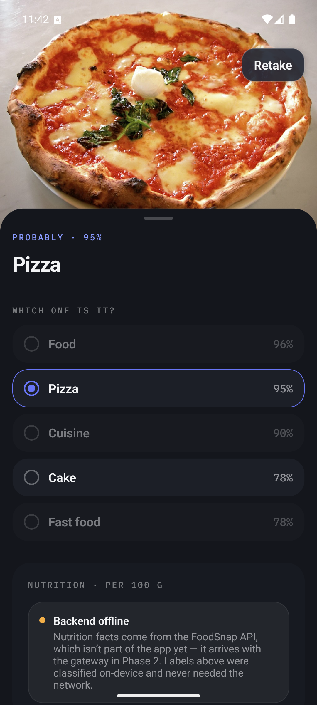
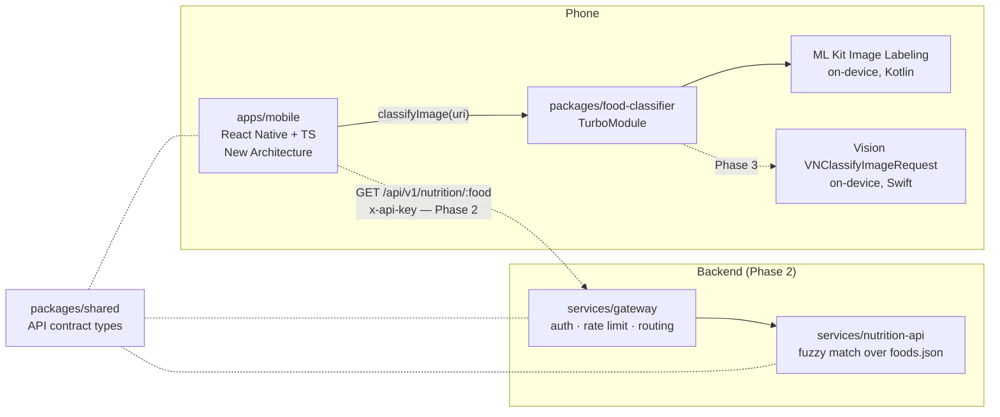

# FoodSnap

Point your camera at food, get labels from an on-device classifier, then nutrition facts from a gateway-fronted TypeScript backend.

<!-- TODO(H5): 10–15 s demo GIF goes here once the Phase 2 flow is recorded. -->



*Android emulator, Phase 1: ML Kit labels a real photo on-device. The nutrition card sits in its "backend offline" state because the API arrives in Phase 2.*

## Why this exists

I built this in 2026 to have a compact, honest example of an architecture I work in professionally: a React Native app in TypeScript talking to native modules I wrote myself — Kotlin on Android, Swift on iOS — with a gateway-fronted Node backend behind it, containerized, and CI that distributes a signed Android build outside the app stores.

It is a deliberately scoped demonstration project, not a product, and not something with years of history behind it. Where I chose the cheap path over the correct-at-scale path, the code says so in a comment.

**Status:** Phase 1 is done — the Android app classifies real photos on-device. Phase 2 (gateway, nutrition API, Docker, CI, signed APK releases) and Phase 3 (iOS/Vision parity, history, Terraform) are next. Progress lives in [`IMPLEMENTATION_PLAN.md`](IMPLEMENTATION_PLAN.md).

## Architecture



Solid arrows exist today; dashed ones are the phases still ahead.

The split matters: **classification never touches the network**, so the app is useful offline and there is no per-request inference cost. Only the nutrition lookup crosses the wire, and it goes through a gateway that owns auth and rate limiting rather than letting the app talk to the data service directly.

## Monorepo tour

Yarn (Berry) workspaces with `nodeLinker: node-modules` — React Native's tooling assumes a physical `node_modules`, so PnP and pnpm are both out.

```
apps/mobile/              React Native app (TypeScript, New Architecture, Hermes)
  src/screens/            CaptureScreen, ResultsScreen (+ a dev token gallery)
  src/theme/              design tokens — code form of docs/DESIGN.md
  src/hooks/              useClassifier — wraps the native module call
  src/navigation/         native-stack, dark-only
packages/food-classifier/ TurboModule: TS spec + Kotlin (ML Kit) + iOS stub
packages/shared/          API contract types shared by app and services  [Phase 2]
services/gateway/         Fastify API gateway — the only public entry point [Phase 2]
services/nutrition-api/   Fastify nutrition lookup, internal only          [Phase 2]
infra/                    docker-compose + Terraform                  [Phase 2/3]
docs/DESIGN.md            visual source of truth: tokens, components, screens
```

TypeScript is `strict` everywhere. ESLint and Prettier are configured once at the root and govern every workspace.

## The native module

`packages/food-classifier` is where the interesting part is, so it is worth reading even if you skim the rest.

**The spec is the contract.** A single TypeScript file declares what the module does:

```ts
export interface Classification {
  label: string;      // e.g. "pizza"
  confidence: number; // 0..1
}

export interface Spec extends TurboModule {
  classifyImage(uri: string): Promise<Classification[]>;
  isAvailable(): Promise<boolean>;
}
```

React Native's **codegen** reads that spec at build time and generates the native base classes — `NativeFoodClassifierSpec` in Java/Kotlin, a JSI interface on the C++ side. The Kotlin class extends the generated spec, so if the TypeScript and the Kotlin disagree about a method signature, the Android build fails instead of the app crashing at runtime. This is the practical win of TurboModules over the old bridge: the type boundary is checked by the compiler, and calls are synchronous JSI rather than serialized JSON over an async queue.

**Threading.** `classifyImage` must not block the UI thread. ML Kit's `Task` API already runs inference on its own executor; the success and failure listeners fire back on the main thread, which is a safe place to resolve or reject a TurboModule promise. Callers get a normal JS `Promise`, and rejections carry stable codes (`E_FILE_NOT_FOUND`, `E_CLASSIFICATION_FAILED`) so the UI can branch on the failure rather than parse a message.

**The tradeoff, stated plainly.** ML Kit's default labeler is a *generic* image classifier, not a food model. A photo of a margherita pizza comes back as `Food 96%`, `Pizza 95%`, `Cuisine 90%`, `Cake 78%`. Two consequences the app handles client-side: the top hit is often a category word that would be useless to look up ("food"), so a stop list demotes those and dims them in the list; and a wrong-but-specific guess like "Cake" stays visible, because the user is better placed to correct it than a heuristic is. Bundling a food-specific TFLite or CoreML model would remove the whole problem and is on the roadmap — it is the single biggest quality improvement available here.

## Running it locally

**Prerequisites**

- Node 20+ and Corepack (`corepack enable`) — Yarn 4 comes from the `packageManager` field, don't install it globally.
- Android Studio with an SDK and an emulator (or a device with USB debugging).
- **JDK 21.** Android Gradle Plugin needs 17+; if `java -version` reports anything older, point Gradle at Android Studio's bundled JDK in `~/.gradle/gradle.properties`:
  ```properties
  org.gradle.java.home=/Applications/Android Studio.app/Contents/jbr/Contents/Home
  ```
  This is a machine-level setting, which is why it is not committed.

**Run the app**

```bash
yarn install
```

Start an emulator (or plug in a device), then from the repo root:

```bash
yarn workspace foodsnap-mobile android
```

That builds the debug APK, installs it, and starts Metro. Snap a photo — or tap **Library** and pick one — and the Results screen shows real on-device labels. The nutrition card will say "backend offline": correct for Phase 1, since there is no backend yet.

**Useful extras**

```bash
yarn lint && yarn typecheck
```

To eyeball the design tokens against [`docs/DESIGN.md`](docs/DESIGN.md), flip `SHOW_TOKEN_GALLERY` to `true` in `apps/mobile/App.tsx`.

**The backend** (`docker compose up` in `infra/`) lands in Phase 2, together with the API key the app will need.

## CI/CD and installing the APK

Both GitHub Actions workflows are Phase 2 work and not in the repo yet:

- `ci.yml` — typecheck, lint, and Jest on every push and PR. No emulator jobs; the native module is mocked in app tests.
- `release-android.yml` — on a `v*` tag, decodes a signing keystore from repository secrets, runs `assembleRelease`, and attaches the signed `foodsnap-<version>.apk` to a GitHub Release.

The point of that second workflow is the out-of-store distribution story: a signed native Android app, built by CI, downloaded and sideloaded directly. Keystore generation, the four required secrets, and install instructions will be documented here when the workflow exists.

## Roadmap

- **Food-specific model** (TFLite on Android, CoreML on iOS) to replace the generic labeler — the biggest accuracy win available.
- **iOS parity** via the Vision framework, plus a TestFlight lane.
- **Live camera frames** with `react-native-vision-camera` instead of one still per snap.
- **Diary and portions** — daily targets, portion editing, manual entry, on-device history; all designed in [`docs/DESIGN.md`](docs/DESIGN.md).
- **History sync** behind the gateway, once there is an account to sync to.

## License

MIT — see [`LICENSE`](LICENSE).
