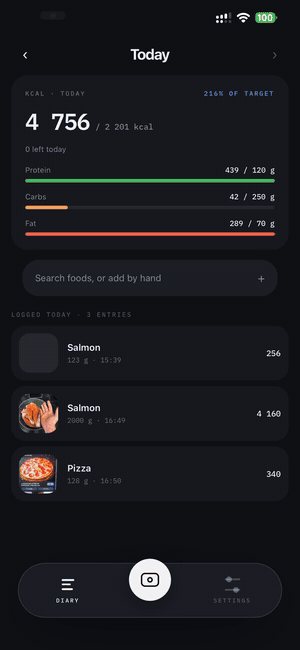
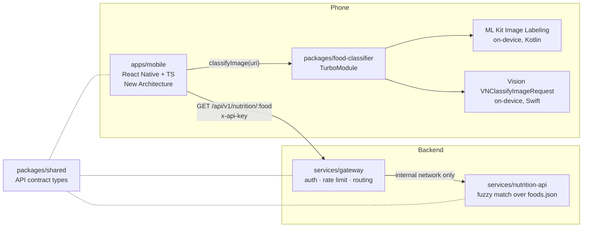

# FoodSnap

Point your camera at food, get labels from an on-device classifier, then nutrition facts from a gateway-fronted TypeScript backend.

<p align="center">
  
</p>

*Android emulator, unedited apart from playback speed: an empty diary, a photo classified on-device, the portion picked as "2 slices", and the day's totals landing at 681 / 2,200 kcal. "Food", "Cuisine" and "Fast food" are dimmed because they are category words, not dishes — see the tradeoff below.*

## Why this exists

I built this in 2026 to have a compact, honest example of an architecture I work in professionally: a React Native app in TypeScript talking to native modules I wrote myself — Kotlin on Android, Swift on iOS — with a gateway-fronted Node backend behind it, containerized, and CI that distributes a signed Android build outside the app stores.

It is a deliberately scoped demonstration project, not a product, and not something with years of history behind it. Where I chose the cheap path over the correct-at-scale path, the code says so in a comment.

**Status:** working on Android and iOS. Photos are classified on-device — ML Kit on Android, Vision on iOS — nutrition comes from the containerized backend through the gateway, and portions are logged to a local diary with daily targets. Signed APKs ship from CI to GitHub Releases. [`IMPLEMENTATION_PLAN.md`](IMPLEMENTATION_PLAN.md) tracks every task and, for each one, what was actually verified rather than assumed — including the parts that are not.

## Architecture



The dashed lines to `packages/shared` are compile-time only — it is types, not a runtime dependency. Everything else exists today.

The split matters: **classification never touches the network**, so the app is useful offline and there is no per-request inference cost. Only the nutrition lookup crosses the wire, and it goes through a gateway that owns auth and rate limiting rather than letting the app talk to the data service directly.

## Monorepo tour

Yarn (Berry) workspaces with `nodeLinker: node-modules` — React Native's tooling assumes a physical `node_modules`, so PnP and pnpm are both out.

```
apps/mobile/              React Native app (TypeScript, New Architecture, Hermes)
  src/screens/            Diary, Capture, Results, Portion, Search, Settings
  src/theme/              design tokens — code form of docs/DESIGN.md
  src/hooks/              useClassifier, useNutrition
  src/navigation/         glass tab bar over a native stack, dark-only
  src/lib/                label ranking, MMKV diary store, nutrition cache
  src/api/                typed gateway client
packages/food-classifier/ TurboModule: TS spec + Kotlin (ML Kit) + Swift (Vision)
packages/shared/          API contract types imported by the app and both services
services/gateway/         Fastify API gateway — the only public entry point
services/nutrition-api/   Fastify nutrition lookup, internal only
infra/                    docker-compose.yml + Terraform for Cloud Run
docs/DESIGN.md            visual source of truth: tokens, components, screens
```

TypeScript is `strict` everywhere. ESLint and Prettier are configured once at the root and govern every workspace.

## The native module

`packages/food-classifier` is where the interesting part is, so it is worth reading even if you skim the rest.

**The spec is the contract.** A single TypeScript file declares what the module does:

```ts
export interface Classification {
  label: string;      // e.g. "pizza"
  confidence: number; // 0..1
}

export interface Spec extends TurboModule {
  classifyImage(uri: string): Promise<Classification[]>;
  isAvailable(): Promise<boolean>;
}
```

React Native's **codegen** reads that spec at build time and generates the native base classes — `NativeFoodClassifierSpec` in Java/Kotlin, a JSI interface on the C++ side. The Kotlin class extends the generated spec, so if the TypeScript and the Kotlin disagree about a method signature, the Android build fails instead of the app crashing at runtime. This is the practical win of TurboModules over the old bridge: the type boundary is checked by the compiler, and calls are synchronous JSI rather than serialized JSON over an async queue.

**Threading.** `classifyImage` must not block the UI thread. ML Kit's `Task` API already runs inference on its own executor; the success and failure listeners fire back on the main thread, which is a safe place to resolve or reject a TurboModule promise. Callers get a normal JS `Promise`, and rejections carry stable codes (`E_FILE_NOT_FOUND`, `E_CLASSIFICATION_FAILED`) so the UI can branch on the failure rather than parse a message.

**Two engines, one contract.** Android uses ML Kit's image labeler in Kotlin; iOS uses the Vision framework's `VNClassifyImageRequest` in Swift, bridged to the ObjC codegen spec (`create-react-native-library` no longer ships a Swift TurboModule template). Both return the top 5 above a 0.1 confidence floor, both reject with the same two codes, and both keep inference off the UI thread. The JavaScript cannot tell which one answered — that is what the shared spec buys.

**The tradeoff, stated plainly.** Neither engine is a food model; both are *generic* image classifiers. ML Kit sees a margherita pizza as `Food 96%`, `Pizza 95%`, `Cuisine 90%`, `Cake 78%`. Vision is worse in an interesting way: on a salad it returns `tableware 49%`, `utensil 49%`, `bowl 49%` *above* `food` and `salad` — it ranks the objects in the photo over the thing you are trying to log.

So the app ranks client-side. A stop list of category words and tableware demotes them out of the default selection and dims them in the list, which is why a naive "take the top hit" would have looked up the nutrition of a utensil. A wrong-but-specific guess like "Cake" is left bright and selectable, because the user is better placed to correct that than a heuristic is. The list is [evidence-driven](apps/mobile/src/lib/labels.ts) — every entry was observed coming out of one of the two engines, and the real outputs are pinned as test fixtures.

Bundling a food-specific TFLite or CoreML model would delete this whole problem, and it is the single biggest quality improvement available here.

## The backend

Two Fastify services in TypeScript, and the split between them is the point.

**`nutrition-api`** is internal and never published. It holds a hand-written database of 139 foods with per-100 g macros, and resolves a label by trying an exact match on the name or any alias first, then normalized Levenshtein over all ~470 keys. Aliases are chosen for what a classifier actually emits, so `granny smith` resolves to Apple and `hot dog` to Hot dog, and misspellings like `spagetti` still land on Pasta.

fuse.js was the first choice and had to go: its bitap search matches a short query *inside* a longer key, which on short food names produced confident nonsense — `xyzzy` scored 0.48 against "fizzy drink", `sky` 0.54 against "streaky bacon", `outdoor` 0.57 against "hotdog". Whole-string edit distance has no such failure mode. The 0.7 threshold is measured rather than guessed: real misspellings score 0.83–1.00, the junk classifiers emit scores below 0.7 against every key, and the gap between is where a threshold belongs. Below it the service returns 404 — a nutrition app that invents calories is worse than one that admits it does not know. The database is validated at boot, so a typo in the JSON stops the process with a precise message instead of surfacing as `NaN` kcal in the UI.

**`gateway`** is the only public entry point, and it is a real gateway rather than a passthrough:

- **Auth**: an `x-api-key` header checked against the environment. A wrong key and a missing key get byte-identical responses, so a prober learns nothing about which keys exist. The header is stripped before the request is forwarded — the internal service has no business seeing client credentials.
- **Rate limiting**: 60 requests per minute, bucketed *per key* rather than per IP, because every phone behind one carrier NAT would otherwise share a bucket. Unkeyed requests fall back to IP so the limit cannot be dodged by omitting the header.
- **Resilience**: an upstream timeout mapped to `502`, so a wedged service returns an error instead of holding the client socket open.
- **Observability**: a request id generated per request, echoed in error bodies and forwarded upstream, so one user-reported failure can be followed across both services.

The routing table is data, not code ([`services/gateway/src/config.ts`](services/gateway/src/config.ts)) — adding a second internal service is one entry plus an environment variable, no new proxy logic. `/health` on both services stays public and unlimited so container probes need no secret.

Request and response types live in [`packages/shared`](packages/shared) and are imported by the app and both services, so there is exactly one definition of the contract and a change breaks the build on whichever side did not keep up.

## Running it locally

**Prerequisites**

- Node 20+ and Corepack (`corepack enable`) — Yarn 4 comes from the `packageManager` field, don't install it globally.
- Android Studio with an SDK and an emulator (or a device with USB debugging).
- **JDK 21.** Android Gradle Plugin needs 17+; if `java -version` reports anything older, point Gradle at Android Studio's bundled JDK in `~/.gradle/gradle.properties`:
  ```properties
  org.gradle.java.home=/Applications/Android Studio.app/Contents/jbr/Contents/Home
  ```
  This is a machine-level setting, which is why it is not committed.

**Run the app**

```bash
yarn install
```

Start an emulator (or plug in a device), then from the repo root:

```bash
yarn workspace foodsnap-mobile android
```

That builds the debug APK, installs it, and starts Metro. Snap a photo — or tap **Library** and pick one — and the Results screen shows real on-device labels. The nutrition card will say "backend offline": correct for Phase 1, since there is no backend yet.

**Run it on iOS**

```bash
cd apps/mobile/ios && bundle exec pod install
```

```bash
yarn workspace foodsnap-mobile ios
```

The Vision classifier works on the simulator — no device needed, since it runs on the CPU rather than the Neural Engine.

**Run the backend**

```bash
cd infra && cp .env.example .env && docker compose up --build
```

Only the gateway is published, on `:8080`; the nutrition service is reachable only from inside the compose network, and compose waits for it to report healthy before starting the gateway. Both images are multi-stage and run as a non-root user, ~253 MB each. Then point the app at it — copy `apps/mobile/.env.example` to `apps/mobile/.env`, set `API_KEY` to match one of the gateway's `API_KEYS`, and rebuild (react-native-config bakes these in at build time, so a reload is not enough).

> On an Android emulator the gateway URL must be **`http://10.0.2.2:8080`** — `10.0.2.2` is how the emulator reaches your host, whereas `localhost` is the emulator itself. The iOS simulator can use `localhost`, and a physical device needs your machine's LAN address.

Without Docker you can run the two services directly, which is what I did while building them:

```bash
yarn workspace @foodsnap/nutrition-api build && yarn workspace @foodsnap/nutrition-api start
API_KEYS=dev-local-key-change-me NUTRITION_API_URL=http://127.0.0.1:3001 \
  yarn workspace @foodsnap/gateway build && yarn workspace @foodsnap/gateway start
```

**Useful extras**

```bash
yarn lint && yarn typecheck && yarn test
```

To eyeball the design tokens against [`docs/DESIGN.md`](docs/DESIGN.md), flip `SHOW_TOKEN_GALLERY` to `true` in `apps/mobile/App.tsx`.

## CI/CD

Two workflows, both in [`.github/workflows`](.github/workflows):

- [`ci.yml`](.github/workflows/ci.yml) — on every push and PR: install with `--immutable` (so lockfile drift is a red build), then typecheck, lint, and Jest across all workspaces. There are no emulator or simulator jobs; the native module is mocked, which keeps the run fast and hermetic.
- [`release-android.yml`](.github/workflows/release-android.yml) — on a `v*` tag: decode the signing keystore, build a signed APK, attach it to a GitHub Release.

## Distributing outside the app stores

This is the part of the project I actually wanted to demonstrate: a signed native Android app, built by CI, installed straight from a URL — no Play Store in the loop.

### One-time setup

**1. Generate a release keystore.** Keep it somewhere safe and outside the repo; if you lose it you cannot ship an upgrade to an already-installed app, only a fresh install under a different signature.

```bash
keytool -genkeypair -v -storetype PKCS12 -keystore foodsnap-release.keystore -alias foodsnap -keyalg RSA -keysize 2048 -validity 10000
```

**2. Base64-encode it** so it can live in a GitHub secret:

```bash
base64 -i foodsnap-release.keystore | pbcopy
```

**3. Add four repository secrets** under Settings → Secrets and variables → Actions:

| Secret | Value |
|---|---|
| `ANDROID_KEYSTORE_BASE64` | the base64 blob from step 2 |
| `KEYSTORE_PASSWORD` | the store password you chose |
| `KEY_ALIAS` | `foodsnap` (or your alias) |
| `KEY_PASSWORD` | the key password you chose |

Add `API_KEY` as a secret too — it is baked into the APK for the nutrition lookup — and `GATEWAY_URL` as a repository *variable* if the build should point somewhere other than the default.

The keystore and passwords are never committed and never written into the repo tree: CI decodes the keystore into `RUNNER_TEMP` and passes the passwords through the environment, and `android/app/build.gradle` reads them from there.

### Cutting a release

```bash
git tag v0.1.0 && git push origin v0.1.0
```

The workflow derives `versionName` from the tag (`v0.1.0` → `0.1.0`) and `versionCode` from the run number, since Android needs that to increase monotonically for an install to count as an upgrade. It then verifies the APK is *not* debug-signed before publishing — `build.gradle` deliberately falls back to debug signing when no keystore is present, so that a local `assembleRelease` works for anyone cloning the repo, and that fallback must never reach a release.

### Installing the APK

1. Open the [Releases](https://github.com/askarpenko7/foodsnap/releases) page on your Android device and download `foodsnap-<version>.apk`.
2. Tap the download. Android will refuse the first time and offer a settings toggle — this is the "install unknown apps" permission, granted per source app (your browser or file manager), not globally.
3. Allow it, tap the APK again, and install.

Play Protect may show a "scan this app?" prompt for an app it has not seen before; that is expected for anything distributed this way, and installing anyway is fine for a build you signed yourself. Upgrades install over the top as long as they are signed with the same keystore.

## Roadmap

- **Food-specific model** (TFLite on Android, CoreML on iOS) to replace the generic labelers — the biggest accuracy win available, and it would delete the stop list.
- **Diary and portions** — daily targets, portion editing, search and manual entry, all designed in [`docs/DESIGN.md`](docs/DESIGN.md) and not yet built.
- **Live camera frames** with `react-native-vision-camera` instead of one still per snap.
- **TestFlight lane** for iOS, to match the APK story on Android.
- **History sync** behind the gateway, once there is an account to sync to.

## License

MIT — see [`LICENSE`](LICENSE).
